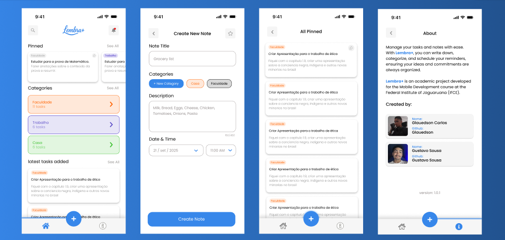

<div align="center">

# Lembra+


Lembra+ is a productivity app designed to help you manage notes and tasks in an organized way.

</div>


## 🟦 Topics

- [About project](#1)
- [Functions](#2)
- [Technologies used](#3)
- [How to install](#4)
- [Screenshots](#5)
- [Architecture](#6)
- [License](LICENSE)
- [Developers](#7)

---

<div id=1>

## 🟦 About project
</div>
**Lembra+** is a note-taking mobile application created to help users easily write, organize, and manage their notes in a simple and intuitive way. The project was developed as part of the **System Analysis and Development** degree program, for the **Mobile Development** course, by [Glauedson Carlos](https://github.com/Glauedson) and [Gustavo Sousa](https://github.com/GustavoDeltta).

<div id=2>

## 🟦 Functions
</div>

With Lembra+, you can:

- Create notes and tasks easily  
- Organize them into categories  
- Set due dates for better planning  
- Pin important notes and tasks to the home screen for quick access  

<div id=3>

## 🟦 Technologies used
</div>

- Linguagem: **Kotlin**
- IDE: **Android Studio**
- Framework: **Jetpack Compose**

<div align="center">

[](https://skillicons.dev)

</div>

<div id=4>

## 🟦 How to install
</div>

To run the project locally, follow the steps below:
 1. **Clone this repository**

    ```bash
    git clone https://github.com/Glauedson/Lembra-Plus-task-app.git
    ```

  2. **Open the project in Android Studio**
    
        - Launch Android Studio

        - Click on **File** > **Open...**

        - Select the project folder you just cloned

  3. **Wait for Gradle to sync**

        - Android Studio will automatically download all required dependencies.
   4. **Run the application**

        - Connect a physical Android device or start an emulator
        - Click the **Run** ▶️ button on the toolbar

<div id=5>

## 🟦 Screenshots
</div>



<div id=6>

## 🟦 Architecture
</div>

The project follows a **clean and modular architecture**, organizing the code into well-defined packages to ensure maintainability, scalability, and readability.

📂 Package structure

```
com.progmobile.lembraplus
│
├── data/                 # Data layer: DAOs, models, repositories
│   ├── db/               # Database access using Room
│   │   ├── dao/          # Data Access Objects (CategoryDao, TaskDao)
│   │   └── model/        # Entities and database configuration
│   └── repository/       # Repositories to abstract data sources
│
├── theme/                # Application theming and typography
│
├── ui/                   # User Interface layer
│   ├── components/       # Reusable Compose components
│   │   ├── CategoryCard/ # Each component has its logic and props separated
│   │   ├── HeaderTitle/
│   │   ├── NavBar/
│   │   ├── NewCategoryModal/
│   │   └── TaskCard/
│   ├── screens/          # App screens (Home, About, Create Task, etc.)
│   └── vms/              # ViewModels and their factories (MVVM pattern)
│
├── utils/                # Utility classes and helper functions
│
└── MainActivity.kt       # App entry point
 ```

🧱 Layer overview

**Data Layer:**

>Handles all data-related operations. Uses Room for local storage, with DAOs for database queries and Repositories as intermediaries between the database and the ViewModels.

**UI Layer:**

>Built using Jetpack Compose, separating UI logic and styling into different files. Each component (e.g., CategoryCard) contains:
> - A main composable responsible for layout and rendering.
>- A corresponding Props file (e.g., CategoryCardProps.kt) to define data and parameters, keeping logic decoupled from visual design.

**ViewModel Layer (vms):**

>Implements the MVVM (Model–View–ViewModel) pattern. ViewModels handle state management and communicate with repositories to provide data to the UI.

**Theme Layer:**
>Defines global styles such as colors and typography for a consistent visual identity.

**Utils Layer:**
>Contains helper classes and shared utilities used across the app (e.g., color utilities, route navigation).

<div id=7>

## 🟦 Developers
</div>

<table align="center">
  <tr>
    <td align="center">
      <a href="https://github.com/Glauedson">
        
        <br />
        <sub><b>Glauedson Carlos</b></sub>
      </a>
      <br />
      💻 Developer
    </td>
    <td align="center">
      <a href="https://github.com/GustavoDeltta">
        
        <br />
        <sub><b>Gustavo Silva</b></sub>
      </a>
      <br />
      💻 Developer
    </td>
  </tr>
</table>